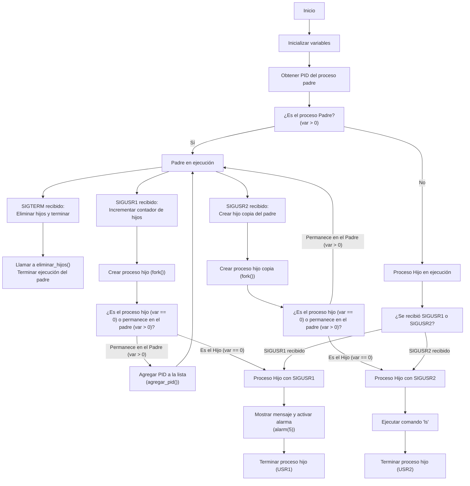
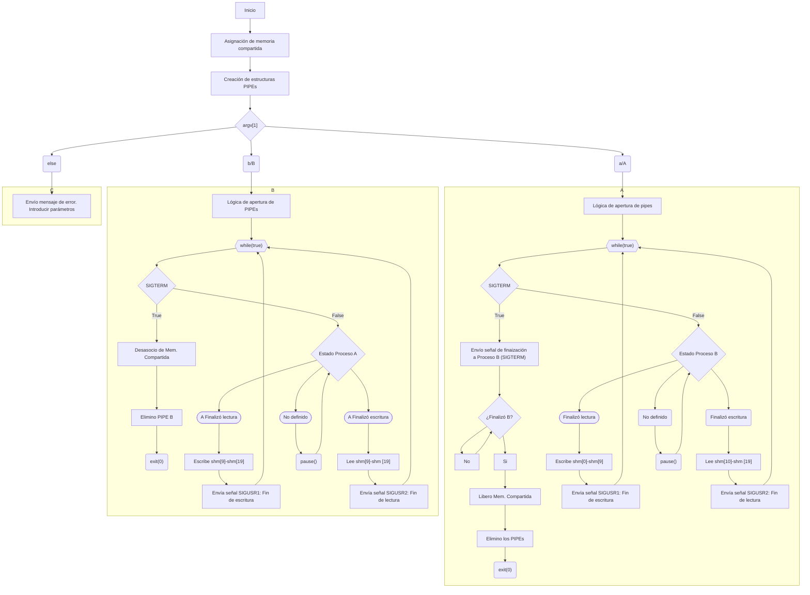

# Entregable Practica 2

### Scatena, Adriano 74725/9

### Rolandelli, Lautaro 74366/5

## Indice

1. [Ejercicio 10](#ejercicio-10)
   1. [Consigna](#consigna)
   2. [Problemática](#problemática)
   3. [Resolución](#resolución)
   4. [Diagrama de Flujo](#diagrama-de-flujo)
   5. [Modo de uso](#modo-de-uso)
2. [Ejercicio 11](#ejercicio-11)
   1. [Consigna](#consigna-1)
   2. [Problemática](#problemática-1)
   3. [Resolución](#resolución-1)
   4. [Diagrama de Flujo](#diagrama-de-flujo-1)
   5. [Modo de uso](#modo-de-uso-1)
3. [Bibliografía](#bibliografia)

_Para esta práctica se establecieron dos ejercicios como entregables. A continuación se replican sus respectivos informes de desarrollo, evidenciando la problemática y desafíos a resolver, las decisiones y estrategias tomadas, así como el modo de uso del programa resultante._

## Ejercicio 10

## Consigna

Escriba un programa que cada vez que reciba la señal SIGUSR1 cree un hijo, que imprimirá su PID y el del padre **cada cinco segundos**. Por otra parte, cada vez que reciba la señal SIGUSR2, cree un hijo que deberá imprimir su PID y ejecutar, mediante una función de la familia `exec()`, un programa de los que reside en `/bin` (p. ej., ls, date, time, cd, pwd, ...), luego de esto dicho hijo terminará. Si el programa original,recibe la señal SIGTERM, terminará todos los procesos hijos que fueron creados con SIGUSR1, a razón de uno por segundo, indicando el PID de cada uno de los procesos terminados y por último terminará él mismo.

## Problemática

#### Objetivo:

_Implementar un programa en C con un manejo eficiente de señales capaces de crear y gestionar procesos hijos a partir de un proceso padre. Realizar la correcta utilización de `alarm()` y de interrupciones para el manejo de acciones temporizadas. Ahondar en el uso de `exec()` y del proceso de finalización de procesos hijos mediante la señal SIGTERM._

La problemática a resolver en este programa involucra lograr una gestión efectiva de señales y un control eficiente sobre la creación dinámica de procesos. Uno de los principales desafíos es la correcta implementación de manejadores de señales, específicamente SIGUSR1 y SIGUSR2, que requieren la creación de procesos hijos en respuesta a dichas señales. Esto implica asegurarse de que los procesos hijos impriman su PID y el del padre de manera continua cada cinco segundos, lo que conlleva la necesidad de manejar el temporizador (a través de `alarm()`) y la sincronización de procesos adecuadamente. Adicionalmente, el uso de la función `exec()` para ejecutar comandos en `/bin` presenta la dificultad de gestionar el reemplazo del proceso hijo, garantizando que este termine correctamente después de la ejecución del comando en `exec()`. Análogamente, se debe implementar un mecanismo eficaz para la terminación de todos los procesos hijos creados al recibir la señal SIGTERM, asegurando que cada uno finalice de manera controlada, lo que implica la correcta identificación de los PIDs de los procesos hijos y como estos se guardan. Este proceso requiere la capacidad de manejar concurrentemente múltiples procesos, controlando condiciones de carrera y problemas de sincronización si no se implementa correctamente.

### Resolución

La resolución del ejercicio 10 consiste en diversas estrategias de control que van desde la gestión de los PIDs de procesos hasta la gestión de señales y temporizadores, cada una de ellas trabajando conjuntamente en un mismo programa.
La administración de las señales presentes en el programa se realiza principalmente mediante los manejadores personalizados para cada una de ellas. Dado que se trata de rutinas de servicio frente a la interrupción de recibir una señal, no se debe declarar en las mismas bloques de código que requieran de un procesamiento notable, o peor aún, que pongan en riesgo el bloqueo del programa principal. Se toma como estrategia, implementar en los propios manejadores variables tipo _bool_ que funcionen como _flags_, activándose con el arribo de la señal e indicando dicha recepción. El procesamiento causal a la captación se describe en el código principal del proceso donde se quiere establecer el comportamiento. Debido a la inclusión de dichos manejadores, es necesaria la inclusión de la librería estándar de C `<signal.h> `, donde una de sus funciones más interesantes y utilizadas es la función `signal()`, utilizada para asignar una función de manejo o _handler_ a una señal para un proceso. En este caso se establecen 4 _handlers_ diferentes, uno por cada señal en particular, pero funcionando todos de la manera previamente especificada, "activando" las _flags_ correspondientes a cada uno, y en ciertos casos imprimiendo en la terminal mensajes informativos (sobretodo de chequeo o _debugging_). Al iniciar el proceso padre (dentro del `main()` del programa), se declaran los manejadores y las respectivas señales:

```C
    signal(SIGUSR1, sigusr1);
    signal(SIGUSR2, sigusr2);
    signal(SIGTERM, sigterm);
```

A excepción de la señal `SIGALARM`, la cual únicamente será declarada en el entorno del o los procesos hijos, ya que serán estos mismo los que hacen uso del temporizador. También se declara la variable tipo `pid_t` (que es un tipo de dato declarado en `<sys/types.h>`
específico para almacenar identificadores de proceso o PIDs) nombrada `var`. la cual se inicializa con el PID del proceso padre pero se encargará de almacenar el PID del proceso que la llame.
Establecido el entorno del proceso padre, dentro de un bucle infinito (tipo `while(true)`), mediante la variable `var` se realiza la división de bloques de código o rutinas a realizar según sea un proceso padre o hijo, y se realiza mediante una estructura de control condicional tipo `if`. Dado que el valor de retorno de la función `fork()` (incluida en `<unistd.h>` y utilizada para la creación de procesos hijos mediante la clonación del proceso que la llama) varía según que proceso se trate, siendo el valor de retorno el PID del proceso hijo para el proceso padre; y 0 para el proceso hijo (si ocurre un error, devuelve -1), se guardan dichos valores en `var` y se la utiliza para lograr dividir las rutinas dedicadas para cada proceso. Es de especial importancia aclarar que al crear un proceso hijo con `fork()`, este hereda una copia del entorno del proceso padre, o que incluye variables globales, manejadores de señales, variables de entorno, entre otras cosas. Sin embargo, ambos procesos serán posteriormente independientes en cuanto al entorno, y cambios en uno no afectan al otro (salvo en el caso de recursos compartidos explícitamente). Esta característica será aprovechada posteriormente.
El bloque de código dedicado al proceso padre se esmera en configurar al mismo como un administrador de señales, es decir, inmediatamente al entrar al bucle `while()` entra en un estado de suspensión o bloqueo (utilizando la función `pause()`) hasta que recibe una señal, es decir espera un evento asíncrono. En caso de recibir una señal, se activará la _flag_ pertinente y al salir del estado de bloqueo se elige su accionar según otra estructura de control condicional que chequea el estado de las _flags_.

- **SIGUSR1**: Si el proceso padre recibe esta señal, luego de realizar la rutina pertinente, realiza la clonación mediante `fork()` y agrega el PID del hijo a la lista dinámica que contiene los PIDs de los mismos (solos los creados mediante esta señal) mediante la función `agregar_pid(pid_t)` explicada en el [Anexo A](#a-función-agregar_pidpid_t-anexo-a). Luego resetea la _flag_ `usr1` **solo en su propio entorno**. Esto es importante ya que se utiliza a favor el hecho de que la _flag_ se mantenga en valor `true` para el proceso hijo a la hora de dividir comportamientos entre procesos creados por esta señal o por `SIGUSR2`. Para el caso del proceso hijo, en esta sección (ya que comienza a ejecutarse inmediatamente luego de `fork()`) se le quitan de su entorno los manejadores de señales de padre agregándose únicamente el destinado a recibir la señal `SIGALARM` del temporizador.

```C
    signal(SIGALRM, sigalarm);
    signal(SIGUSR1, SIG_DFL);
    signal(SIGUSR2, SIG_DFL);
    signal(SIGTERM, SIG_DFL);
```

- **SIGUSR2**: Si el proceso padre recibe esta señal, realiza de igual manera que en el caso anterior tanto la creación del proceso hijo como el reseteo **en su entorno** de la _flag_ correspondiente (`usr2`), es decir que la misma se mantiene activa para los procesos hijos. Para el proceso hijo, se quitan idénticamente los manejadores se señales establecidos en el entorno del proceso padre, reseteandolos a los manejadores default mediante la palabra clave `SIG_DFL`.

- **SIGTERM**: Si el proceso padre recibe esta señal, se activa la _flag_ `Ssigterm` y el padre ejecuta la función `eliminar_hijos()`, encargada de realizar la finalización **_cada 1 segundo_** de los procesos hijo creados mediante la señal `SIGUSR1`. Esta función es explicada en el [Anexo B](#b-función-eliminar_hijosvoid-anexo-b).

Continuando dentro del mismo bucle infinito, se explicita el la rutina a seguir por los procesos hijos, separándose entre estos según mantengan la variable `usr1` o `usr2` activa.

- **USR1**: Para los hijos que tienen `usr1` activa (es decir que fueron creados mediante la llegada de `SIGUSR1`), se establece la condición de que una segunda _flag_ `_5seg` (indicadora de que la señal de `SIGALARM` fue recibida luego de 5 segundos de establecimiento) esté activa, ya que debe realizar su propósito (imprimir su PID y el del padre) **cada cinco segundos**. Inicialmente `_5seg` estará activa para acceder a esta sección la primera vez. Luego se resetea dicha _flag_ y se imprime el PID propio como el del padre mediante el uso de `getpid()` y `getppid()`. Por último se vuelve a setear (o se setea por primera vez) el timer de 5 segundos con `alarm(5)`.

- **USR2**: Para los hijos que tienen `usr2` activa (es decir que fueron creados mediante la llegada de `SIGUSR2`), directamente se ejecuta el comando `ls` de _bash_ haciendo uso de `execl()`, la cual se utiliza para reemplazar ejecutar un archivo binario especificando su ruta (ya que no se utiliza `execlp()`) y los argumentos necesarios, reemplazando completamente el proceso original con el nuevo (en este caso el pertinente al comando `ls`). Técnicamente este nuevo proceso termina automáticamente después de completar su tarea, que consiste en listar los archivos y directorios en el directorio actual, por lo que no sería necesario anexar la última linea de la sección `exit(0)`, ya que el proceso original fu reemplazado por `ls` y este termina solo. Se incluye solo por evitar que si hay un error en `execl()` no llegue a terminarse el proceso hijo.

## Diagrama de Flujo



## Modo de Uso

Para la ejecución del programa principal debe primero compilarse el archivo _.c_ que contiene el script del propio ejercicio. Para ello debe ejecutarse mediante la terminal de _bash_ el compilador de C del proyecto GNU `gcc`, generando un archivo ejecutable (o archivo de objeto).

```bash
    gcc e10.c -o < nombre_ejecutable >
```

A partir del ejecutable, es posible mediante la misma terminal correr el programa. Para hacerlo puede extenderse el siguiente comando:

```bash
    ./<nombre_ejecutable>
```

De esta manera se iniciará el proceso padre. Para comunicarse con el mismo y probar sus funciones, debe enviarle las pertinentes señales. Convenientemente debe abrirse otra terminal, de la cual se le enviarán la señales mediante el comando `kill`, de la siguiente forma:

```bash
    kill -<nombre_señal> <pid_padre>
```

De esta forma se logrará observar en la primera terminal como el proceso padre comienza a ejecutar sus funcionalidades consecuentemente los procesos hijos.

## Ejercicio 11

## Consigna

Escriba un programa que utilice un arreglo de 20 int, compartido entre dos procesos A y B de manera tal que A escriba los primeros 10, y B los lea solamente después que se completó la escritura. De la misma manera B escribirá los 10 últimos enteros del arreglo y A los leerá solamente después que B complete la escritura. Este proceso se repetirá hasta que el Proceso A reciba la señal SIGTERM, y cuando la reciba debe a su vez hacer terminar el proceso B, y liberar todos los recursos compartidos utilizados.
Los datos serán números entre 0 y 26, (representando letras entre la a y la z), que serán cifrados previo a la escritura mediante una función de cifrado de la forma $𝑓(𝑥) = (𝑎𝑥 + 𝑏)\cdot𝑚𝑜𝑑\;𝑛$. En donde (a,b) serán claves públicas que estarán disponibles en memoria compartida. Para el descifrado de los datos se usará la función inversa $𝑓^{-1}(𝑥) = (𝑘𝑥 + 𝑐)\cdot𝑚𝑜𝑑\, 𝑛$, en donde $(k,c)$ son claves privadas conocidas solo por el proceso lector. Como función de cifrado se usará $𝑓(𝑥) = (4𝑥 + 5)\cdot 𝑚𝑜𝑑\;27$ y para el descifrado $𝑓^{-1} (𝑥) = (7𝑥 + 19)\cdot 𝑚𝑜𝑑\;27$.
Ambos procesos realizarán primero la escritura de los datos en la zona correspondiente y luego la lectura. **_Ninguno de los dos procesos puede escribir en su zona hasta que el otro no haya leído los datos, excepto la primera vez_**. La escritura en ambos casos se realizará a razón de un valor por segundo, mientras que la lectura se realizará tan rápido como se pueda y se imprimirá en pantalla junto con la identificación del proceso que está leyendo.
El programa debe ser **único**, es decir el mismo programa puede actuar como proceso A o como proceso B, dependiendo de un parámetro que se pase en la línea de comando. (por ejemplo “programa a” o “programa b”). Realice su implementación _basada en memoria compartida._

## Problemática

#### Objetivo:

_El objetivo del problema es implementar un programa de sincronización entre dos procesos independientes, A y B, usando memoria compartida y funciones IPC para gestionar la lectura y escritura de buffer de 20 enteros.Para asegurar la integridad de la comunicación y evitar condiciones de carrera, se implementará una estrategia de espera activa o señales de sincronización que regulen el acceso al buffer. Los datos deben ser codificados y decodificados mediante funciones modulares específicas. La finalización del proceso implica la liberación controlada de los recursos solo cuando A recibe SIGTERM, provocando la terminación de B._

La problemática del problema se posa principalmente en la implementación de un sistema de comunicación sincronizada entre procesos independientes (IPC), que comparten un segmento de memoria, como un _buffer_. En este se debe gestionar tanto la integridad de los datos (es decir que sus valores no cambien mientras un proceso los lee/escribe), la atomicidad de los mismos, como también la correcta liberación de los recursos utilizados. La solución requiere una sincronización entre los procesos A y B en sus operaciones de lectura y escritura en el arreglo compartido. Cada proceso debe de esperar hasta que el otro complete su acción, para así poder decidir la acción a tomar antes de continuar, lo cual evita condiciones de carrera (desfasajes entre los tiempos de los procesos), y asegura que los datos leídos sean coherentes con los escritos.
Para coordinar los accesos a la memoria compartida, es necesario que al establecer los mecanismos de comunicación y sincronización se eviten bloqueos o incoherencias en el proceso y en los datos a gestionar. Se debe obtener entonces, una estrategia eficiente, como el uso de señales, para permitir a cada proceso alternar ordenadamente entre las operaciones sin detener innecesariamente al otro.
Se plantea además que cada valor del arreglo, que representa letras, debe ser cifrado por un proceso antes de escribirlo en memoria, y por ende, descifrarlo con el otro proceso al leerlo. Esto implica el uso de funciones de cifrado y descifrado modulares.
Además,dado que el proceso A actúa como controlador para el proceso B, debe responder a la señal SIGTERM, asegurando la terminación correcta del proceso B y además, liberar los recursos compartidos para evitar fugas de memoria. La terminación coordinada plantea el desafío de asegurarse de que ambos procesos finalicen en un estado coherente, liberando el segmento de memoria compartida, si están en uso.

### Resolución

Para la implementación del ejercicio 11, se consideraron diversas alternativas para realizar la comunicación y sincronización entre procesos, optando finalmente por un diseño basado en memoria compartida y señales.

Para la resolución, se impuso como objetivo lograr la optimización en la comunicación y sincronización entre los procesos A y B, así como lograr la división necesaria para que a partir de un mismo programa, poder accionar tanto como proceso A y/o como Proceso B. En una primera búsqueda,Se evaluó en lograr un programa con uso exclusivo de memoria compartida, estructura la cual, además de contener el arreglo de datos, incluyera también los PID de cada proceso y banderas que indicaran cuándo cada proceso podía realizar sus actividades. Este enfoque permitía la comunicación mediante la escritura y lectura de estos elementos en memoria compartida, pero no era una opción viable. Almacenar variables de control, como PIDs o flags de estado de los procesos, directamente en la memoria compartida, cuyo objetivo principal es ser una estructura tipo buffer, puede generar problemas de consistencia y sincronización, dado que ambos procesos acceden concurrentemente a esta memoria, por lo que si ocurren condiciones de carrera desfavorables, pueden intentar leer o escribir valores al mismo tiempo, corrompiendo los datos de control. Además, tanto flags como PIDs almacenados en memoria compartida no están protegidos por mecanismos de sincronización, lo que implica que sus estados pueden volverse inconsistentes, complicando la coordinación y pudiendo causar bloqueos o comportamientos no deseados.

Una mejor práctica es usar otros mecanismos de IPC para control, como señales, que permiten coordinar el acceso sin interferir en los datos compartidos. De esta manera, el segmento de memoria compartida se enfoca solo en almacenar los datos transmitidos, mientras que los recursos de control permanecen sincronizados y consistentes en cada proceso. Para mejorar la eficiencia, la segunda opción planteó el uso de archivos _pipes_ para intercambiar los PID entre procesos. Los _pipes_, al ser una vía de comunicación unidireccional entre procesos, facilitan el intercambio de los identificadores, permitiendo que cada proceso enviara su PID al otro sin tener que almacenarlos en la memoria compartida. Por otro lado se aprovecha el uso de señales y sus manejadores para la comunicación entre procesos, eliminando así las banderas de memoria compartida. Con este enfoque, cada proceso notifica al otro de manera directa cuando puede proceder a leer o escribir mediante el envío de una señal, que el otro proceso, con un manejador adecuado, debe poder lograr interpretar el significado del arribo de la misma. Este sistema permite que los procesos gestionen de manera más eficiente su flujo de trabajo consultando únicamente las banderas de estado presentes en su entorno.

#### PIPES

Las estructuras tipo _pipeline_ o _pipe_, se utilizan como una forma efectiva para intercomunicar los procesos, transfiriendo información entre ellos. En este caso, se emplean específicamente para compartir los PID de cada uno, lo cual es esencial para la comunicación a través de señales. Así, cada proceso guarda su PID en un buffer como un entero, y lo transfiere por el pipe al otro proceso, habilitando una comunicación bidireccional y sincronizada, clave para la funcionalidad del programa.

Para inicializar los Pipes, se emplea el comando `mkfifo`, que crea pipes nombrados con permisos específicos. Con esta configuración, `pipe_fifoA` y `pipe_fifoB` se crean inicialmente, para que cada proceso escriba su propio PID y lea el PID del otro. Para utilizar estos pipes en el código, el proceso abre el pipe correspondiente con `open()`, espera (de ser necesario) a que otro proceso lo abra también en modo lectura, y cumplida dicha condición escribe su PID utilizando `write()`. Luego lee el PID del otro proceso con `read()`, almacenando ambos en variables. Esta actualización y lectura del pipe permite que cada proceso sepa el PID de su contraparte para enviar las señales requeridas en el programa.
En la resolución de este problema, se implementó una lógica de bucle "bloqueante" en el proceso A cuando este mismo intenta abrir el `pipe_fifoA`, donde se chequea el valor de retorno de esta acción llevada a cabo por `write()`, ya que esta función se bloquea en caso de que el pipe no esté abierto por otro proceso en modo lectura (es decir, si no hay un proceso para leer el pipe). De esta manera, no se ejecutaba la rutina de finalización y liberación de memoria si A recibía la señal `SIGTERM`. Por ello se implementó un bucle bloqueante, al cual se accede si `write()` devuelve la bandera de error `ENXIO`, donde se comunica en la terminal que se espera un proceso lector del pipe y se procede a intentar abrir nuevamente el mismo hasta que un proceso (el proceso B) lo abra. Se incluye la rutina de servicio frente a la interrupción de la señal `SIGTERM` dentro del bucle, de manera de poder romper con él si es necesario.

#### Memoria compartida

La memoria compartida es una técnica de comunicación entre procesos (IPC) que permite que múltiples procesos accedan a un área de memoria común, sin tener que copiar datos de un proceso a otro.

En este programa, la memoria compartida se configura en dos pasos: creación y asociación. Para inicializar la memoria se emplea la función propia de C `shmget`, que recibe una clave (`shm_key`), el tamaño deseado a reservar y permisos de acceso a la memoria, teniendo com valor de retorno un ID de memoria compartida (`shm_ID`). Posteriormente, este ID es utilizado por la función adyacente `shmat`, que asocia el segmento de memoria al proceso, devolviendo un puntero que permite referirse directamente a esta memoria en el código (`*shm`).

En la memoria compartida, solo se almacenarán los datos escritos por cada proceso, actuando como un _buffer_.

#### Logica de procesos

##### A

El Proceso A comienza su ciclo principal notificando por terminal su PID. Luego procede a realizar la escritura y lectura de los pipes correspondientes. Establecida la comunicación con el proceso B, comienza el bucle de escritura/lectura. Este bucle administra el accionar del proceso frente a los estados de B. Cada proceso envía la señal `SIGUSR1` cuando terminó de escribir y `SIGUSR2` cuando terminó de leer. Estas señales habilitan la _flag_ de recepciń de señal (`signRecv`) en cada proceso, así como las variables de estado correspondiente para cada proceso (`lectB`, `escB`,`lectA`,`escA`). De esta manera, se implementa la idea de que cada proceso accionará en la memoria compartida escribiendo o leyendo datos si y solo si se estableció una comunicación con el proceso B y por ende se conoce el estado actual en el que se encuentra el proceso (salvo la primera vez donde ambos procesos entran a escribir sus respectivas partes de la _shared memory_). Si el proceso B terminó de leer, es decir que en A `lectB` está activada, este proceso procede a escribir valores cifrados en los primeros 10 elementos del arreglo compartido, simulando un retraso entre escrituras con `sleep()`. Cada número se genera aleatoriamente y luego se cifra con la función `cifrar()`. Al completar su escritura, A chequea si hubo un arribo de `SIGTERM`, en caso falso procede a enviar la señal `SIGUSR1` a B, habilitandolo para que lea su porción del arreglo. Para la escritura se sigue la misma lógica solo que chequeando la veracidad de `escB`. Al entrar en cada rutina se desactivan las flags tanto de lectura/escritura como `signRecv`, indicando que se consumió la información por ellas provista. El proceso A lee los últimos 10 elementos escritos por B, descifrando los valores con la función `descifrar()`, yal finalizar (antes chequeando la llegada de `SIGTERM`) envía la señal `SIGUSR2` a B, indicándole a este último que puede escribir.
En caso de haber recibido `SIGTERM`, A envía inmediatamente la misma señal a B (que tiene una rutina propia de finalización). Luego procede a entrar en un bucle de chequeo del proceso B, buscando saber si este finalizó. Para esto se utiliza la función de usuario `cheq_proc()` explicada en el [Anexo C](#c-función-int-cheq_procpid_t). Una vez que B finalizó, es decir que el mismo se desvinculó de la memoria compartida, A procede a desvincularse también y marcar y eliminar el bloque de memoria compartida. Finalmente elimina el `pipe_fifoA` (así como B elimina el suyo).
El proceso A entrará en un estado de pausa bloqueante si detecta que no recibió señales del proceso B o externas (es decir, se consumió a información del último estado de B y no se ha vuelto este a comunicar con A, `signRecv` está en estado _false_). Esta pausa lo deja a la espera de nuevas señales que logren indicar como debe accionar.

##### B

El Proceso B, por su parte, sigue un ciclo de flujo paralelo al de A. No se implementa todo el bucle bloqueante como en el proceso A al abrir `pipe_fifoB` ya que este proceso no está destinado a recibir `SIGTERM` externamente, solo del proceso A, por lo que se puede tolerar el estado bloqueado intrínseco de las funciones `write()` y `read()`.
El bucle de acción sobre la memoria compartida es muy similar al de A, chequeando únicamente variables diferentes, en este caso llamadas `lectA` y `escA`, que indican si el proceso A terminó de leer y escribir respectivamente. La rutina de servicio para cuando B recibe `SIGTERM` de A es ligeramente diferente, ya que B solo se encarga de desvincularse de la memoria compartida y eliminar `pipe_fifoB` con `remove()`, procediendo inmediatamente a terminar con `exit()`.
Al igual que el proceso A, este proceso también entra en un estado bloqueante de pausa si su variable indicadora de recibimiento de señal (`signRecv`) no se encuentra activada, indicando que A no se comunicó por lo que se desconoce su estado actual y se espera que el mismo se comunique.

##

Para la versión final implementada, correspondiente al ejecutable `e11.c`, se hizo un ligero cambio en el uso de las variables de estado para cada proceso. Se redujo la cantidad de indicadores necesarios para el manejo de la dinámica de cada proceso, ya que en la nueva implementación, solo se utilizó un indicador que controle la escritura o lectura de los primeros diez elementos del arreglo, y otro que maneje la escritura o lectura de los últimos diez. Resultando así un manejo un poco más sencillo, pero que en la práctica funcionan de la misma manera. El flujo de cada proceso es exactamente el mismo, salvo que cuando uno le indica al otro que ya puede trabajar sobre esa sección de memoria, envía la señal correspondiente y el manejador de la misma se encarga de alterar el estado de esa variable para  el proceso que recibe la señal, y pueda ahora trabajar sobre el segmento de memoria que liberó el proceso que envió la señal. Se aclara que para las secciones de diagrama de flujo y modo de uso, el programa responde a la misma lógica e implementación, a excepción de esta ligera modifiación expresada. En resumen, las variables implementadas responden a:

``` C
flag_1 == 1 // A escribe.
flag_1 == 0 // B lee.
flag_2 == 1 // B escribe.
flag_2 == 0 // A lee. 
```

## Modo de Uso

Para ejecutar el programa del ejercicio 11, es necesario contar con el archivo fuente y compilarlo en la terminal. La compilación se realiza de la siguiente manera:

```bash
gcc e11.c -o ejercicio11 -lrt
```

Una vez compilado, los procesos A y B deben ejecutarse en dos terminales distintas, especificando el rol de cada proceso como un parámetro. Las ejecuciones deben realizarse de la siguiente manera:

```bash
./ejercicio11 A
```

```bash
./ejercicio11 B
```

Es importante que ambos procesos estén en ejecución para que puedan leer y escribir en la memoria compartida. La inicialización de ambos es indispensable debido a que la comunicación se realiza a través de pipes, que requieren que ambos extremos estén activos para poder sincronizar los procesos correctamente. Aunque una opción sería permitir que un proceso inicie la escritura independientemente de la presencia del otro, en este caso se eligió mantener la sincronización inicial para asegurar un control secuencial al inicio del programa.

Para terminar la ejecución del programa, se debe enviar la señal SIGTERM al proceso A desde una tercera consola. Esto puede realizarse con el comando kill, seguido del PID del proceso A, de la siguiente forma:

```bash
kill -SIGTERM <PID_de_A>
```

Una vez que el proceso A reciba la señal SIGTERM, se encargará de finalizar el proceso B y de liberar los recursos compartidos, asegurando un cierre ordenado del programa.

#### Limitacion

Una limitación del programa es que, aunque los procesos A y B pueden ejecutarse de forma independiente, hasta que ambos estén en ejecución, no comenzarán a escribir o leer en la memoria compartida. Esto se debe a la dependencia de sincronización que presentan los pipes, la cual requiere que ambos procesos estén activos para que pueda realizarse la comunicación inicial. Si bien se podría implementar una alternativa en la que un proceso empiece a escribir en la memoria compartida sin esperar al otro, se optó por mantener esta sincronización inicial para asegurar un control secuencial y evitar posibles inconsistencias al inicio. Sin embargo, una vez ambos procesos estén ejecutándose, no es necesario que esperen entre sí para realizar sus tareas; cada proceso procederá a escribir o leer tan pronto como la sincronización de señales lo permita.

## Diagrama de flujo



## Anexo

### A. Función _agregar_pid(pid_t)_

La función `agregar_pid(pid_t)` se implementa con el objetivo de facilitar, mediante el llamado de una sola función y entregando únicamente un PID, el almacenamiento de los PIDs propios de los hijos creados por el arribo de `SIGUSR1`. Para ello se trabajan con una nueva estructura (`nodo`) que contendrá el PID mencionado y un puntero a una estructura igual que será el siguiente "nodo" en la lista dinámica a conformar. Al llamar la función se reserva la memoria dinámica necesaria par la nueva estructura, y en esta misma se guarda tanto el PID dado como parámetro, como también se hace "apuntar" el puntero a estructura a la estructura `nodo` previa (o la inicial en el primer caso). Es decir que se conforma una lista del tipo LIFO (_last in - first out_). Una vez hecho, se actualiza como última estructura la estructura actual.
Véase el código:

```C
    void agregar_pid(pid_t pid)
    {
        nodo *nuevo = malloc(sizeof(nodo));
        nuevo->pid = pid;
        nuevo->siguiente = head;
        head = nuevo;
    }
```

### B. Función _eliminar_hijos(void)_

La función `eliminar_hijos(void)` se implementa con el objetivo de facilitar, mediante el llamado de una sola función, la eliminación de cada hijo creado por `SIGUSR1`. Actuará hasta que se libere toda la lista dinámica (`head != NULL`). Moviendo a una variable auxiliar la estructura más reciente, se procede a leer el PID que almacena y enviar una señal de terminación al proceso hijo con dicho PID mediante el uso de la función `kill()`. Luego se actualiza la estructura más reciente a la precedente a la actual (a la inversa que a función `agregar_pid(pid_t )`), para liberar la memoria reservada para la estructura actual que ya no tiene más utilidad. Se impone el retardo de eliminación de procesos cada 1 segundo mediante la función `sleep(1)`.
Véase el código fuente:

```C
    void eliminar_hijos()
    {
        nodo *temp;
        while (head != NULL)
        {
            temp = head;
            printf("Terminando con el hijo cuyo PID es: \033[0;31m%d\033[0m\n", temp->pid);
            kill(temp->pid, SIGTERM);
            head = head->siguiente;
            free(temp);
            sleep(1);
        }
    }
```

### C. Función _int cheq_proc(pid_t)_

La función `int cheq_proc(pid_t)` se implementa con el objetivo de lograr conocer el estado (activo o inactivo) de un proceso mediante el envío de una **señal de comprobación**, listada como 0. El valor de retorno fijado en el manejador de errores `errno` es `ESRCH` si la señal enviada no es recibida por ningún proceso, indicando que el proceso al que se le intenta enviar la señal finalizó. Esta bandera es utilizada para lograr un valor de retorno de la función `int cheq_proc(pid_t)`, al cual se le da uso en el programa. Dado que el envío de la señal se realiza con `kill(pid, 0)`, se debe pasar como parámetro a la función el PID del proceso que se quiere comprobar.
Véase el código fuente:

```C
    int cheq_proc(pid_t pid) {
        if (kill(pid, 0) == 0) { // proceso activo
            return 1;
        } else if (errno == ESRCH) { // proceso no existe
            return 0;
        } else { // error
            perror("\033[0;31mError al comprobar estado del proceso\033[0m");
            return -1;
        }
    }
```

## Bibliografia

1. ["signal ()- manejar señales de interrupción.", 2024 -10-07.](https://www.ibm.com/docs/es/i/7.5?topic=functions-signal-handle-interrupt-signals)

2. ["Creación y duplicación de procesos.", 2013-08-17.](https://www.programacion.com.py/escritorio/c/creacion-y-duplicacion-de-procesos-en-c-linux)

3. ["Comunicación entre procesos (IPC).", 2012.](https://sopa.dis.ulpgc.es/prog_c/IPC.HTM)
4. ["IPC through Shared Memory.", 2024.](https://www.javatpoint.com/ipc-through-shared-memory)
5. ["Named Pipe or FIFO"](https://www.geeksforgeeks.org/named-pipe-fifo-example-c-program/)
